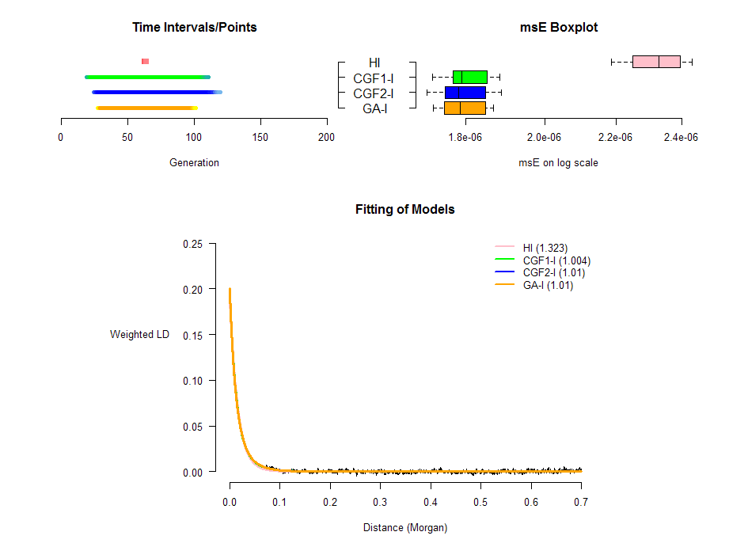
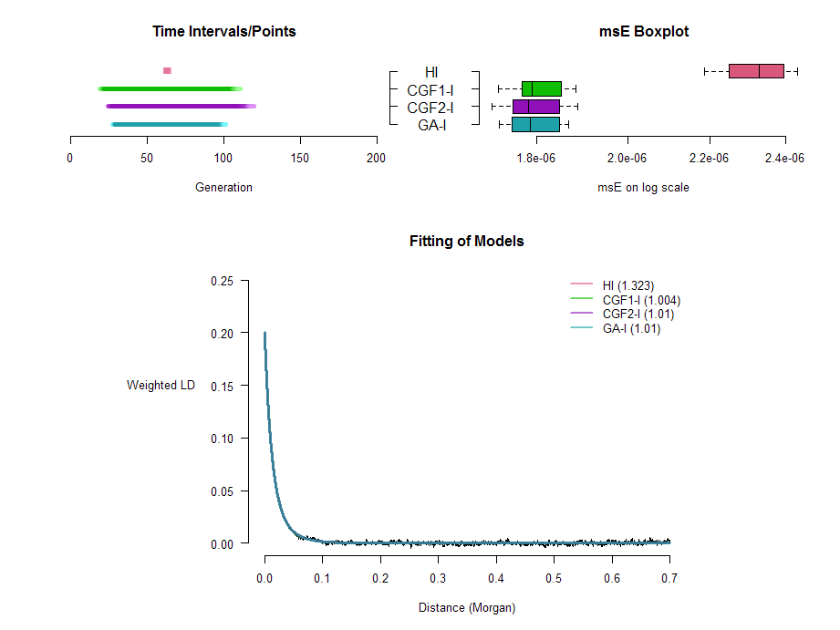

An Introduction to **CAM** package
===============

This package does Continuous Admixture Modeling (CAM) and related summary. It introduces three new S3 classes, **CAM.single**, **CAM** and **CAM.conclusion**, and some corresponding methods. It also contains some utility functions and two simulated data sets (*CGF_50* and *GA_I*) for illustration.

-----------

## Computation

### Single LD Decay Curve

The function `singleCAM()` does CAM for a single LD decay curve. For example:


```r
library(CAM)
data(CGF_50)
d<-CGF_50$Distance
y<-CGF_50$Combined_LD
fit<-singleCAM(d=d,y=y,m1=0.3,T=70L,isolation=FALSE)
fit
```

```
## Continuous Admixture Inference (CAM) for a Single LD Decay Curve
## 
## Function call: singleCAM(d = d, y = y, m1 = 0.3, T = 70L, isolation = FALSE)
## 
## Length of Used LD: 3497 
## 
##      Model Start End          msE
## HI      HI    23  NA 8.912686e-06
## CGF1  CGF1    49   1 1.654922e-06
## CGF2  CGF2    60   1 2.750241e-06
## GA      GA    53   1 5.509048e-06
```

where `d` corresponds to genetic distance and `y` corresponds to an LD decay curve. The admixture proportion for population 1 ($m_1$) is 0.3 for this data set.

Here the class of `fit` is **CAM.single**, and it has its own method for `print()`.

Parallel computation is supported provided that **foreach** package and **doSNOW** package are installed. It is recommended to library them before utilizing the parallel computation.

See the help page of `singleCAM()` for more examples.

### Multiple LD Decay Curves (.rawld File)

The function `CAM()` does CAM for a .rawld file with multiple LD decay curve. Parallel computation is also supported. For example:


```r
data(GA_I)
library(foreach);library(doSNOW)
```

```
## Loading required package: iterators
## Loading required package: snow
```

```r
fit<-CAM(rawld=GA_I,m1=0.3,T=150L,LD.parallel=TRUE,single.parallel=FALSE)
fit
```

```
## Continuous Admixture Inference (CAM) for a .rawlf File
## 
## Function call:CAM(rawld = GA_I, m1 = 0.3, T = 150L, LD.parallel = TRUE, single.parallel = FALSE)
## 
## Total Length of LD: 3497 
## 
##                   LD  Model Start End          msE  quasi.F
## HI       Combined_LD     HI    63  NA 2.235635e-06 1.323224
## CGF1-I   Combined_LD CGF1-I   105  23 1.695982e-06 1.003815
## CGF2-I   Combined_LD CGF2-I   116  26 1.705954e-06 1.009717
## GA-I     Combined_LD   GA-I   100  29 1.706906e-06 1.010281
## HI1            Jack1     HI    63  NA 2.220300e-06       NA
## CGF1-I1        Jack1 CGF1-I   105  23 1.794603e-06       NA
## CGF2-I1        Jack1 CGF2-I   111  28 1.779137e-06       NA
## GA-I1          Jack1   GA-I    98  30 1.787182e-06       NA
## HI2            Jack2     HI    63  NA 2.358990e-06       NA
## CGF1-I2        Jack2 CGF1-I   106  22 1.852915e-06       NA
## CGF2-I2        Jack2 CGF2-I   115  26 1.848968e-06       NA
## GA-I2          Jack2   GA-I    99  29 1.847539e-06       NA
## HI3            Jack3     HI    64  NA 2.185886e-06       NA
## CGF1-I3        Jack3 CGF1-I   108  22 1.725799e-06       NA
## CGF2-I3        Jack3 CGF2-I   115  27 1.708941e-06       NA
## GA-I3          Jack3   GA-I   101  29 1.723330e-06       NA
## HI4            Jack4     HI    64  NA 2.432188e-06       NA
## CGF1-I4        Jack4 CGF1-I   109  21 1.882746e-06       NA
## CGF2-I4        Jack4 CGF2-I   119  25 1.888059e-06       NA
## GA-I4          Jack4   GA-I    99  30 1.867834e-06       NA
## HI5            Jack5     HI    63  NA 2.423726e-06       NA
## CGF1-I5        Jack5 CGF1-I   110  20 1.802694e-06       NA
## CGF2-I5        Jack5 CGF2-I   118  25 1.803764e-06       NA
## GA-I5          Jack5   GA-I   100  29 1.801889e-06       NA
## HI6            Jack6     HI    64  NA 2.307339e-06       NA
## CGF1-I6        Jack6 CGF1-I   109  21 1.770311e-06       NA
## CGF2-I6        Jack6 CGF2-I   119  25 1.776908e-06       NA
## GA-I6          Jack6   GA-I   100  29 1.763367e-06       NA
## HI7            Jack7     HI    63  NA 2.396205e-06       NA
## CGF1-I7        Jack7 CGF1-I   107  21 1.786312e-06       NA
## CGF2-I7        Jack7 CGF2-I   116  25 1.787210e-06       NA
## GA-I7          Jack7   GA-I   100  28 1.787691e-06       NA
## HI8            Jack8     HI    63  NA 2.304644e-06       NA
## CGF1-I8        Jack8 CGF1-I   108  21 1.774159e-06       NA
## CGF2-I8        Jack8 CGF2-I   115  26 1.750770e-06       NA
## GA-I8          Jack8   GA-I    99  29 1.749116e-06       NA
## HI9            Jack9     HI    64  NA 2.350640e-06       NA
## CGF1-I9        Jack9 CGF1-I   106  23 1.867137e-06       NA
## CGF2-I9        Jack9 CGF2-I   117  26 1.880573e-06       NA
## GA-I9          Jack9   GA-I    99  30 1.868055e-06       NA
## HI10          Jack10     HI    63  NA 2.248512e-06       NA
## CGF1-I10      Jack10 CGF1-I   105  23 1.721175e-06       NA
## CGF2-I10      Jack10 CGF2-I   113  27 1.722507e-06       NA
## GA-I10        Jack10   GA-I    98  30 1.723349e-06       NA
```

One can also specify the file path of the .rawld file in argument `rawld=`.

Here the class of `fit` is **CAM**, and it has its own method for `print()` and `plot()`. A **CAM** object has an element named `CAM.list` consisting of the **CAM.single** objects for each LD decay curve.

Parallel computation is also supported as in the example, provided that **foreach** package and **doSNOW** package are installed. It is recommended to library them before utilizing the parallel computation.

See help page of `CAM()` for more examples.

------------------------

## Summary Plots

A new method of `plot()` for **CAM** class is introduced in this package (`plot.CAM()`). This function generates three plots in a device. The plot on the top left is the estimated time intervals/points for the four models. The color depth of segments/points corresponds to how many intervals/points covers this part in Jackknives. The deeper the color, the more estimates from Jackknives cover this part. The plot on the top right is the boxplot of msE for the four models. The third plot shows the fitting of four models to \code{Combined_LD} in the .rawld file. The numbers after model names in the legend are quasi-F values of the four models for \code{Combined_LD}. For example:


```r
plot(fit)
```

 

where `fit` is obtained in the previous example. One can also run `plot(fit,"GA_I.pdf")` to plot to a .pdf file, which is recommended.

To change the colors of models:


```r
plot(fit,model.cols=matrix(c("pink","red","pink",
                             "lightseagreen","green","green",
                             "skyblue","blue","blue",
                             "yellow","orange","orange"),ncol=4))
```

 

See help page of `plot.CAM()` for more details.

----------------------

## Draw Conclusions on Best Model(s)

The function `conclude.model()` can draw conclusions on which models are the significantly best ones. It takes a "CAM" class object or its summary table as input:


```r
conclusion<-conclude.model(fit)
conclusion<-conclude.model(fit$summary)
conclusion
```

```
## CAM Best Model(s) Conclusion:
## 
## Function call: conclude.model(x = fit$summary)
## 
## Familiwise Error Rate: 0.05
## 
## Best Model(s): CGF1-I, CGF2-I, GA-I
## 
## Group Means of log(msE)/msE:
##    CGF1-I    CGF2-I      GA-I        HI 
## -13.22938 -13.23121 -13.23263 -12.97332 
## 
## Adjusted p-value:
##              CGF1-I       CGF2-I         GA-I           HI
## CGF1-I           NA 8.078541e-01 1.797942e-01 9.238602e-10
## CGF2-I 8.078541e-01           NA 8.078541e-01 8.919968e-10
## GA-I   1.797942e-01 8.078541e-01           NA 9.238602e-10
## HI     9.238602e-10 8.919968e-10 9.238602e-10           NA
```

The function returns an object of **CAM.conclusion** class, which has a special method for `print()`.

Note that this function only selects the significantly best model(s), i.e. the one(s) that are significantly the closest to what is obeserved. It does **NOT** check if the best model(s) are credible or not. The user should check the quasi-F value ans msE in the summary table or plot of a "CAM" class object for this purpose.

See the help page of `conclude.model()` for further information.

-----------------

## Miscellaneous

### Construct a Simple **CAM** object

Sometimes maybe only the summary table of an object of **CAM** class is saved. The function `construct.CAM()` can construct a simple **CAM** object given the original .rawld file, the summary table of the original **CAM** object and the admixture proportion of population 1 $m_1$, which can be passed to `plot.CAM()` function and `conclude.model()` function.


```r
summarydata<-fit$summary
rm(fit)
fit<-construct.CAM(rawld=GA_I,m1=0.3,dataset=summarydata)
fit
```

```
## Continuous Admixture Inference (CAM) for a .rawlf File
## 
## Total Length of LD: 3497 
## 
##                   LD  Model Start End          msE  quasi.F
## HI       Combined_LD     HI    63  NA 2.235635e-06 1.323224
## CGF1-I   Combined_LD CGF1-I   105  23 1.695982e-06 1.003815
## CGF2-I   Combined_LD CGF2-I   116  26 1.705954e-06 1.009717
## GA-I     Combined_LD   GA-I   100  29 1.706906e-06 1.010281
## HI1            Jack1     HI    63  NA 2.220300e-06       NA
## CGF1-I1        Jack1 CGF1-I   105  23 1.794603e-06       NA
## CGF2-I1        Jack1 CGF2-I   111  28 1.779137e-06       NA
## GA-I1          Jack1   GA-I    98  30 1.787182e-06       NA
## HI10          Jack10     HI    63  NA 2.248512e-06       NA
## CGF1-I10      Jack10 CGF1-I   105  23 1.721175e-06       NA
## CGF2-I10      Jack10 CGF2-I   113  27 1.722507e-06       NA
## GA-I10        Jack10   GA-I    98  30 1.723349e-06       NA
## HI2            Jack2     HI    63  NA 2.358990e-06       NA
## CGF1-I2        Jack2 CGF1-I   106  22 1.852915e-06       NA
## CGF2-I2        Jack2 CGF2-I   115  26 1.848968e-06       NA
## GA-I2          Jack2   GA-I    99  29 1.847539e-06       NA
## HI3            Jack3     HI    64  NA 2.185886e-06       NA
## CGF1-I3        Jack3 CGF1-I   108  22 1.725799e-06       NA
## CGF2-I3        Jack3 CGF2-I   115  27 1.708941e-06       NA
## GA-I3          Jack3   GA-I   101  29 1.723330e-06       NA
## HI4            Jack4     HI    64  NA 2.432188e-06       NA
## CGF1-I4        Jack4 CGF1-I   109  21 1.882746e-06       NA
## CGF2-I4        Jack4 CGF2-I   119  25 1.888059e-06       NA
## GA-I4          Jack4   GA-I    99  30 1.867834e-06       NA
## HI5            Jack5     HI    63  NA 2.423726e-06       NA
## CGF1-I5        Jack5 CGF1-I   110  20 1.802694e-06       NA
## CGF2-I5        Jack5 CGF2-I   118  25 1.803764e-06       NA
## GA-I5          Jack5   GA-I   100  29 1.801889e-06       NA
## HI6            Jack6     HI    64  NA 2.307339e-06       NA
## CGF1-I6        Jack6 CGF1-I   109  21 1.770311e-06       NA
## CGF2-I6        Jack6 CGF2-I   119  25 1.776908e-06       NA
## GA-I6          Jack6   GA-I   100  29 1.763367e-06       NA
## HI7            Jack7     HI    63  NA 2.396205e-06       NA
## CGF1-I7        Jack7 CGF1-I   107  21 1.786312e-06       NA
## CGF2-I7        Jack7 CGF2-I   116  25 1.787210e-06       NA
## GA-I7          Jack7   GA-I   100  28 1.787691e-06       NA
## HI8            Jack8     HI    63  NA 2.304644e-06       NA
## CGF1-I8        Jack8 CGF1-I   108  21 1.774159e-06       NA
## CGF2-I8        Jack8 CGF2-I   115  26 1.750770e-06       NA
## GA-I8          Jack8   GA-I    99  29 1.749116e-06       NA
## HI9            Jack9     HI    64  NA 2.350640e-06       NA
## CGF1-I9        Jack9 CGF1-I   106  23 1.867137e-06       NA
## CGF2-I9        Jack9 CGF2-I   117  26 1.880573e-06       NA
## GA-I9          Jack9   GA-I    99  30 1.868055e-06       NA
```

```r
plot(fit)
```

 

```r
conclude.model(fit)
```

```
## CAM Best Model(s) Conclusion:
## 
## Function call: conclude.model(x = fit)
## 
## Familiwise Error Rate: 0.05
## 
## Best Model(s): CGF1-I, CGF2-I, GA-I
## 
## Group Means of log(msE)/msE:
##    CGF1-I    CGF2-I      GA-I        HI 
## -13.22938 -13.23121 -13.23263 -12.97332 
## 
## Adjusted p-value:
##              CGF1-I       CGF2-I         GA-I           HI
## CGF1-I           NA 8.078541e-01 1.797942e-01 9.238602e-10
## CGF2-I 8.078541e-01           NA 8.078541e-01 8.919968e-10
## GA-I   1.797942e-01 8.078541e-01           NA 9.238602e-10
## HI     9.238602e-10 8.919968e-10 9.238602e-10           NA
```

where `fit` is obtained from previous examples.

### Reconstruct Fitted LD Decay Curves

One may want to get the fitted LD decay curves. The function `reconstruct.fitted()` takes a **CAM.single** class object and returns a list containing the best-fit curves for the four models. It can take the **CAM.single** class objects in the constructed a **CAM** class object from `construct.CAM()` as input:


```r
fitted<-reconstruct.fitted(fit$CAM.list[[1]])
str(fitted)
```

```
## List of 4
##  $ HI.fitted    : num [1:3497] NA NA NA NA NA NA NA NA NA NA ...
##  $ CGF1-I.fitted: num [1:3497, 1] 0.199 0.196 0.194 0.191 0.188 ...
##  $ CGF2-I.fitted: num [1:3497, 1] 0.2 0.197 0.194 0.192 0.189 ...
##  $ GA-I.fitted  : num [1:3497, 1] 0.2 0.197 0.194 0.192 0.189 ...
```
