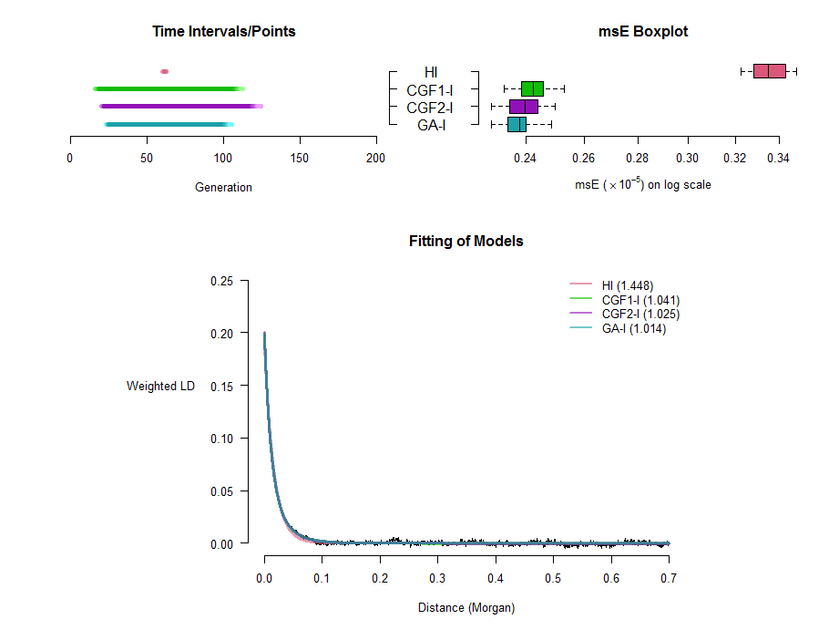
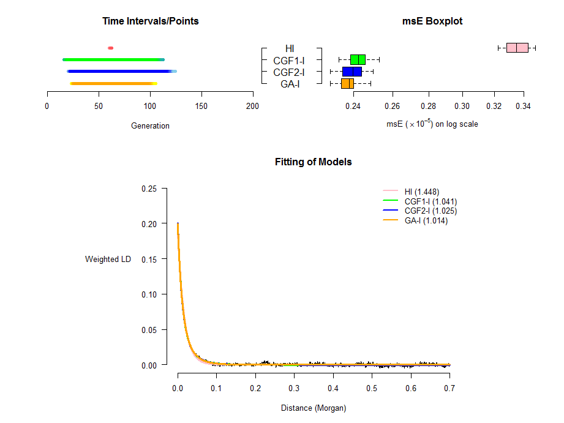

An Introduction to **CAMer** package
===============

**CAMer** package (Continuous Admixture Modeler) does Continuous Admixture Modeling (CAM) and related summary based on the result of ***MALDmef***. It introduces three new S3 classes, **CAM.single**, **CAM** and **CAM.conclusion**, and some corresponding methods. It also contains some utility functions and two simulated data sets (*CGF_50* and *GA_I*) for illustration.

-----------

## Computation

### Single LD Decay Curve

The function `singleCAM()` does CAM for a single LD decay curve. For example, let's use the *CGF_50* data set (the admixture proportion for population 1 ($m_1$) is 0.3) to do CAM with the most ancient generation concerned being 70 (`T=70L`) and core models being HI, CGF1, CGF2 and GA (`isolation=FALSE`):


```r
library(CAMer)
data(CGF_50)
d<-CGF_50$Distance
Z<-CGF_50$Combined_LD
fit<-singleCAM(d=d,Z=Z,m1=0.3,T=70L,isolation=FALSE)
fit
```

```
## Continuous Admixture Inference (CAM) for a Single LD Decay Curve
## 
## Function call: singleCAM(d = d, Z = Z, m1 = 0.3, T = 70L, isolation = FALSE)
## 
## Length of Used LD: 3497 
## 
##  Model Start End          msE
##     HI    23  23 8.912686e-06
##   CGF1    49   1 1.654922e-06
##   CGF2    60   1 2.750241e-06
##     GA    53   1 5.509048e-06
```

where parameter `d` corresponds to genetic distance and parameter `Z` corresponds to an LD decay curve.

One can also specify the file path of the .log file containing the information of `m1` in argument `m1=`.

Here the class of `fit` is **CAM.single**, and it has its own method for `print()`. `fit$summary` is a more comprehensive data frame containing the data frame printed.

Parallel computation is also supported provided that **parallel** package or **snow** package is installed. For newer versions of R (>=2.14.0), **parallel** is in R-core. If only **snow** is available, it is recommended to library it before using the parallel computing functionality.

See the help page of `singleCAM()` for more examples.

### Multiple LD Decay Curves (.rawld File)

The function `CAM()` does CAM for a .rawld file with multiple LD decay curve. Parallel computation is also supported. For example, let's use the *GA* data set ((the admixture proportion for population 1 ($m_1$) is 0.3) with the most ancient generation concerned being 150 (`T=150L`) and core models being HI, CGF1-I, CGF2-I and GA-I (`isolation=TRUE` by default), without using parallel computation for the four models for each LD decay curve (`single.parallel=FALSE`):


```r
data(GA_I)
fit<-CAM(rawld=GA_I,m1=0.3,T=150L,LD.parallel=TRUE,single.parallel=FALSE)
#Usually, one only needs to pass the paths to the .rawld file and to the .log file to CAM():
#fit<-CAM(rawld="path/to/GA_I.rawld",m1="path/to/GA_I.log",T=150L,LD.parallel=TRUE,single.parallel=FALSE)
fit
```

```
## Continuous Admixture Inference (CAM) for a .rawlf File
## 
## Function call:CAM(rawld = GA_I, m1 = 0.3, T = 150L, LD.parallel = TRUE, single.parallel = FALSE)
## 
## Total Length of LD: 3497 
## 
##           LD  Model Start End          msE  quasi.F
##  Combined_LD     HI    62  62 3.269912e-06 1.448423
##  Combined_LD CGF1-I   110  18 2.350439e-06 1.041138
##  Combined_LD CGF2-I   121  22 2.313658e-06 1.024846
##  Combined_LD   GA-I   101  26 2.290190e-06 1.014450
##        Jack1     HI    62  62 3.331873e-06       NA
##        Jack1 CGF1-I   109  19 2.532073e-06       NA
##        Jack1 CGF2-I   119  23 2.498988e-06       NA
##        Jack1   GA-I   102  26 2.487870e-06       NA
##        Jack2     HI    61  61 3.227448e-06       NA
##        Jack2 CGF1-I   110  18 2.361470e-06       NA
##        Jack2 CGF2-I   118  23 2.310203e-06       NA
##        Jack2   GA-I   101  26 2.299594e-06       NA
##        Jack3     HI    61  61 3.477126e-06       NA
##        Jack3 CGF1-I   111  17 2.457821e-06       NA
##        Jack3 CGF2-I   122  21 2.418382e-06       NA
##        Jack3   GA-I   102  25 2.392573e-06       NA
##        Jack4     HI    62  62 3.363831e-06       NA
##        Jack4 CGF1-I   112  17 2.387836e-06       NA
##        Jack4 CGF2-I   121  22 2.348988e-06       NA
##        Jack4   GA-I   104  25 2.343282e-06       NA
##        Jack5     HI    62  62 3.411285e-06       NA
##        Jack5 CGF1-I   109  19 2.402213e-06       NA
##        Jack5 CGF2-I   124  21 2.390199e-06       NA
##        Jack5   GA-I   104  25 2.357778e-06       NA
##        Jack6     HI    62  62 3.289421e-06       NA
##        Jack6 CGF1-I   108  19 2.457056e-06       NA
##        Jack6 CGF2-I   121  22 2.440099e-06       NA
##        Jack6   GA-I   100  27 2.402203e-06       NA
##        Jack7     HI    62  62 3.428745e-06       NA
##        Jack7 CGF1-I   110  18 2.429383e-06       NA
##        Jack7 CGF2-I   121  22 2.406796e-06       NA
##        Jack7   GA-I   103  25 2.398758e-06       NA
##        Jack8     HI    62  62 3.283614e-06       NA
##        Jack8 CGF1-I   107  20 2.527757e-06       NA
##        Jack8 CGF2-I   119  23 2.491798e-06       NA
##        Jack8   GA-I   102  26 2.471097e-06       NA
##        Jack9     HI    61  61 3.479743e-06       NA
##        Jack9 CGF1-I   111  17 2.418923e-06       NA
##        Jack9 CGF2-I   122  21 2.380390e-06       NA
##        Jack9   GA-I   105  24 2.367834e-06       NA
##       Jack10     HI    61  61 3.253384e-06       NA
##       Jack10 CGF1-I   108  19 2.330627e-06       NA
##       Jack10 CGF2-I   118  23 2.291267e-06       NA
##       Jack10   GA-I   103  25 2.289236e-06       NA
```

One can also specify the file path of the .rawld file in argument `rawld=` and the file path of the .log file containing the information of `m1` in argument `m1=`.

Here the class of `fit` is **CAM**, and it has its own method for `print()` and `plot()`. `fit$summary` is a more comprehensive data frame containing the data frame printed. A **CAM** object has an element named `CAM.list` consisting of the **CAM.single** objects for each LD decay curve.

Parallel computation is also supported as in the example, provided that **parallel** package or **snow** package is installed. For newer versions of R (>=2.14.0), **parallel** is in R-core. If only **snow** is available, it is recommended to library it before using the parallel computing functionality.

See help page of `CAM()` for more examples and details.

------------------------

## Summary Plots

A new method of `plot()` for **CAM** class is introduced in this package (`plot.CAM()`). This function generates three plots in a device. The plot on the top left is the estimated time intervals/points for the four models. The color depth of segments/points corresponds to how many intervals/points covers this part in Jackknives. The deeper the color, the more estimates from Jackknives cover this part. The plot on the top right is the boxplot of msE for the four models. The third plot shows the fitting of four models to `Combined_LD` in the .rawld file. The numbers after model names in the legend are quasi-F values of the four models for `Combined_LD`. For example, let's plot the previous result:


```r
plot(fit)
```

 

One can also run `plot(fit,"GA_I.pdf")` to plot to a .pdf file, which is recommended.

To change the colors of models, one can pass a $3 \times 4$ matrix of colors:


```r
plot(fit,model.cols=matrix(c("pink","red","pink",
                             "lightseagreen","green","green",
                             "skyblue","blue","blue",
                             "yellow","orange","orange"),ncol=4))
```

 

See help page of `plot.CAM()` for more details.

----------------------

## Draw Conclusions on Best Model(s)

The function `conclude.model()` can draw conclusions on which models are the significantly best ones and find their estimated time intervals/points. It takes a "CAM" class object or its summary table as input. For example, let's find out the best model(s) from the previous CAM analysis:


```r
conclusion<-conclude.model(fit)
conclusion<-conclude.model(fit$summary)
conclusion
```

```
## CAM Best Model(s) Conclusion:
## 
## Function call: conclude.model(x = fit$summary)
## 
## Familiwise Error Rate: 0.05
## 
## Best Model(s) and Time Estimation:
##  Best.Models End Start
##       CGF2-I  22   121
##         GA-I  25   102
## 
## Group Medians of pseudo log(msE)/msE:
##        HI    CGF1-I    CGF2-I      GA-I 
## -12.84265 -13.23881 -13.30074 -13.33372 
## 
## Adjusted p-value:
##                HI     CGF1-I     CGF2-I       GA-I
## HI             NA 0.01171875 0.01171875 0.01171875
## CGF1-I 0.01171875         NA 0.05468750 0.01171875
## CGF2-I 0.01171875 0.05468750         NA 0.05468750
## GA-I   0.01171875 0.01171875 0.05468750         NA
```

The function returns an object of **CAM.conclusion** class, which has a special method for `print()`.

Note that this function only selects the significantly best model(s), i.e. the one(s) that are significantly the closest to what is observed. It does **NOT** check if the best model(s) are credible or not. The user should check the quasi-F value ans msE in the summary table or plot of a "CAM" class object for this purpose.

See the help page of `conclude.model()` for further information.

-----------------

## Miscellany

### Construct a Simple **CAM** object

Sometimes maybe only the summary table of an object of **CAM** class is saved. The function `construct.CAM()` can construct a simple **CAM** object given the original .rawld file, the summary table of the original **CAM** object and the admixture proportion of population 1 $m_1$, which can be passed to `plot.CAM()` function and `conclude.model()` function. For example, let's "save" the summary table of the previous result (`fit$summary`), then use this function to construct a **CAM** class object and do some further analysis from it:


```r
summarydata<-fit$summary
rm(fit)
fit<-construct.CAM(rawld=GA_I,m1=0.3,dataset=summarydata)
fit
```

```
## Continuous Admixture Inference (CAM) for a .rawlf File
## 
## Total Length of LD: 3497 
## 
##           LD  Model Start End          msE  quasi.F
##  Combined_LD     HI    62  62 3.269912e-06 1.448423
##  Combined_LD CGF1-I   110  18 2.350439e-06 1.041138
##  Combined_LD CGF2-I   121  22 2.313658e-06 1.024846
##  Combined_LD   GA-I   101  26 2.290190e-06 1.014450
##        Jack1     HI    62  62 3.331873e-06       NA
##        Jack1 CGF1-I   109  19 2.532073e-06       NA
##        Jack1 CGF2-I   119  23 2.498988e-06       NA
##        Jack1   GA-I   102  26 2.487870e-06       NA
##        Jack2     HI    61  61 3.227448e-06       NA
##        Jack2 CGF1-I   110  18 2.361470e-06       NA
##        Jack2 CGF2-I   118  23 2.310203e-06       NA
##        Jack2   GA-I   101  26 2.299594e-06       NA
##        Jack3     HI    61  61 3.477126e-06       NA
##        Jack3 CGF1-I   111  17 2.457821e-06       NA
##        Jack3 CGF2-I   122  21 2.418382e-06       NA
##        Jack3   GA-I   102  25 2.392573e-06       NA
##        Jack4     HI    62  62 3.363831e-06       NA
##        Jack4 CGF1-I   112  17 2.387836e-06       NA
##        Jack4 CGF2-I   121  22 2.348988e-06       NA
##        Jack4   GA-I   104  25 2.343282e-06       NA
##        Jack5     HI    62  62 3.411285e-06       NA
##        Jack5 CGF1-I   109  19 2.402213e-06       NA
##        Jack5 CGF2-I   124  21 2.390199e-06       NA
##        Jack5   GA-I   104  25 2.357778e-06       NA
##        Jack6     HI    62  62 3.289421e-06       NA
##        Jack6 CGF1-I   108  19 2.457056e-06       NA
##        Jack6 CGF2-I   121  22 2.440099e-06       NA
##        Jack6   GA-I   100  27 2.402203e-06       NA
##        Jack7     HI    62  62 3.428745e-06       NA
##        Jack7 CGF1-I   110  18 2.429383e-06       NA
##        Jack7 CGF2-I   121  22 2.406796e-06       NA
##        Jack7   GA-I   103  25 2.398758e-06       NA
##        Jack8     HI    62  62 3.283614e-06       NA
##        Jack8 CGF1-I   107  20 2.527757e-06       NA
##        Jack8 CGF2-I   119  23 2.491798e-06       NA
##        Jack8   GA-I   102  26 2.471097e-06       NA
##        Jack9     HI    61  61 3.479743e-06       NA
##        Jack9 CGF1-I   111  17 2.418923e-06       NA
##        Jack9 CGF2-I   122  21 2.380390e-06       NA
##        Jack9   GA-I   105  24 2.367834e-06       NA
##       Jack10     HI    61  61 3.253384e-06       NA
##       Jack10 CGF1-I   108  19 2.330627e-06       NA
##       Jack10 CGF2-I   118  23 2.291267e-06       NA
##       Jack10   GA-I   103  25 2.289236e-06       NA
```

```r
plot(fit)
```

 

```r
conclude.model(fit)
```

```
## CAM Best Model(s) Conclusion:
## 
## Function call: conclude.model(x = fit)
## 
## Familiwise Error Rate: 0.05
## 
## Best Model(s) and Time Estimation:
##  Best.Models End Start
##       CGF2-I  22   121
##         GA-I  25   102
## 
## Group Medians of pseudo log(msE)/msE:
##        HI    CGF1-I    CGF2-I      GA-I 
## -12.84265 -13.23881 -13.30074 -13.33372 
## 
## Adjusted p-value:
##                HI     CGF1-I     CGF2-I       GA-I
## HI             NA 0.01171875 0.01171875 0.01171875
## CGF1-I 0.01171875         NA 0.05468750 0.01171875
## CGF2-I 0.01171875 0.05468750         NA 0.05468750
## GA-I   0.01171875 0.01171875 0.05468750         NA
```

### Reconstruct Fitted LD Decay Curves

One may want to get the fitted LD decay curves. The function `reconstruct.fitted()` takes a **CAM.single** class object and returns a list containing the best-fit curves for the four models. It can take the **CAM.single** class objects in the constructed a **CAM** class object from `construct.CAM()` as input. For example, let's use the **CAM** class object just constructed and reconstruct the fitted curves:


```r
fitted<-reconstruct.fitted(fit$CAM.list[[1]])
str(fitted)
```

```
## List of 4
##  $ HI.fitted    : num [1:3497] 0.191 0.189 0.187 0.184 0.182 ...
##  $ CGF1-I.fitted: num [1:3497] 0.2 0.197 0.194 0.191 0.188 ...
##  $ CGF2-I.fitted: num [1:3497] 0.2 0.198 0.195 0.192 0.189 ...
##  $ GA-I.fitted  : num [1:3497] 0.199 0.197 0.194 0.191 0.188 ...
```


### HI Modle for Single LD Decay Curve

The function `singleHI()` does time inference, of HI model only, for a single LD decay curve. The algorithm is the same as the HI model part of `singleCAM()`. For example, let's use the Combined LD in the *CGF_50* data set and use only HI as the core model:


```r
fit<-singleHI(d,Z,m1=0.3,T=70L)
fit
```

```
## Continuous Admixture Inference (CAM) for a Single LD Decay Curve
## 
## Function call: singleHI(d = d, Z = Z, m1 = 0.3, T = 70L)
## 
## Length of Used LD: 3497 
## 
##  Model Start End          msE
##     HI    23  23 8.912686e-06
```

This function also returns an object of **CAM.single** class, and can be passed to `reconstruct.fitted()`:


```r
fitted<-reconstruct.fitted(fit)
str(fitted)
```

```
## List of 1
##  $ HI.fitted: num [1:3497] 0.195 0.194 0.193 0.193 0.192 ...
```

It is recommended to use this function when only HI model is concerned. See the help page of `singleHI()` for further details.

### HI Model for Multiple LD Decay Curves (.rawld File)

The function `HI()` does time inference, of HI model only, for a .rawld file. The algorithm is the same as the HI model part of `CAM()`. For example, let's again use the *GA_I* data set with the most ancient generation concerned being 150 (`T=150L`), but this time only HI is the core model:


```r
fit<-HI(GA_I,m1=.3,T=150L)
fit
```

```
## Continuous Admixture Inference (CAM) for a .rawlf File
## 
## Function call:HI(rawld = GA_I, m1 = 0.3, T = 150L)
## 
## Total Length of LD: 3497 
## 
##           LD Model Start End          msE  quasi.F
##  Combined_LD    HI    62  62 3.269912e-06 1.448423
##        Jack1    HI    62  62 3.331873e-06       NA
##        Jack2    HI    61  61 3.227448e-06       NA
##        Jack3    HI    61  61 3.477126e-06       NA
##        Jack4    HI    62  62 3.363831e-06       NA
##        Jack5    HI    62  62 3.411285e-06       NA
##        Jack6    HI    62  62 3.289421e-06       NA
##        Jack7    HI    62  62 3.428745e-06       NA
##        Jack8    HI    62  62 3.283614e-06       NA
##        Jack9    HI    61  61 3.479743e-06       NA
##       Jack10    HI    61  61 3.253384e-06       NA
```

The output is also an object of **CAM** class. However, it should *NOT* be passed to `plot()`, and its summary table should *NOT* be passed to `construct.CAM()`.

It is recommended to use this function when only HI model is concerned. See the help page of `HI()` for further details.
